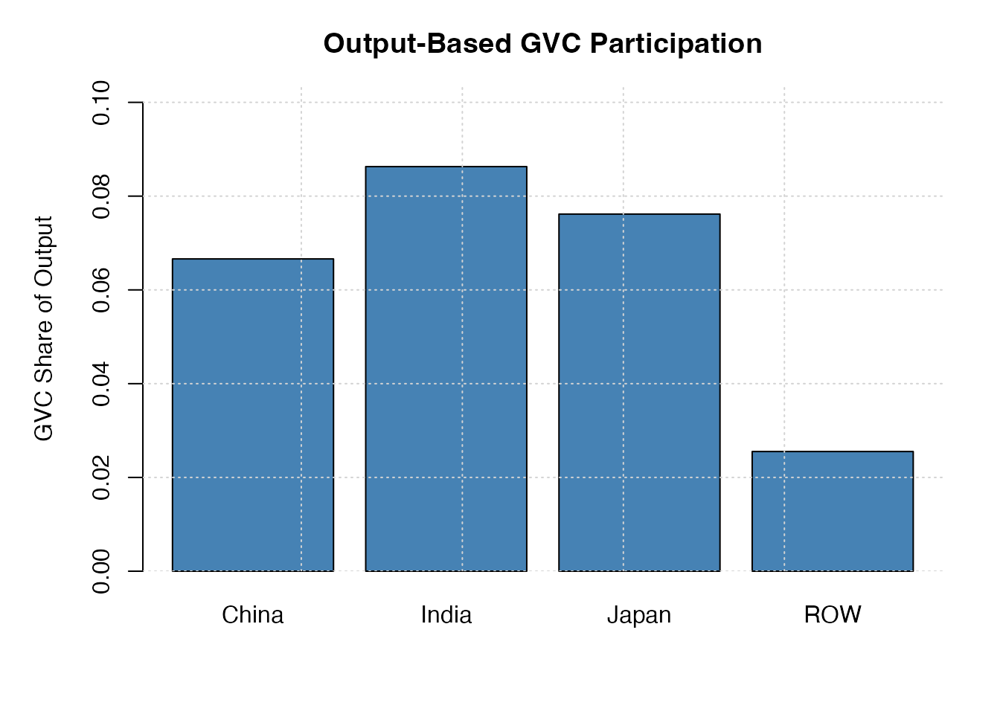
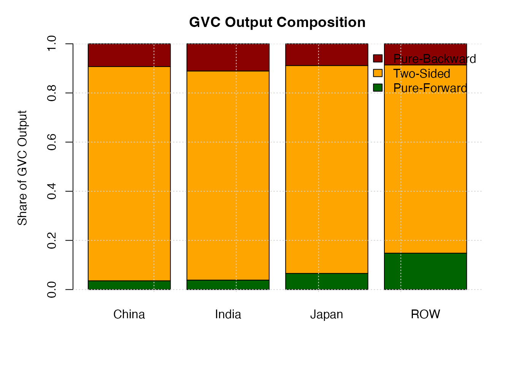

# BM 2025 Output-Based GVC Decomposition

## Introduction

The BM 2025 framework extends GVC measurement beyond trade flows to the
**production side**, decomposing gross output into GVC-related and
non-GVC components. This vignette demonstrates the output-based
decomposition methodology.

### References

Borin, A., Mancini, M., & Taglioni, D. (2025). Economic consequences of
trade and global value chain integration: A measurement perspective.
*The World Bank Economic Review*.

## Conceptual Framework

### Output-Based Decomposition

The BM 2025 output decomposition classifies gross output of country *s*
into:

1.  **DomX**: Purely domestic production (value added never crosses
    borders)
2.  **TradX**: Traditional one-crossing trade
3.  **GVC_PF_X**: Pure-forward GVC output (intermediates for foreign
    production)
4.  **GVC_PB_X**: Pure-backward GVC output (using foreign intermediates)
5.  **GVC_TSImp**: Two-sided GVC output via imported intermediates
6.  **GVC_TSDom**: Two-sided GVC output via domestic intermediates
7.  **GVC_TS_X**: Total two-sided GVC output (TSImp + TSDom)
8.  **GVC_X**: Total GVC-related output (PF + PB + TS)

The fundamental identity: **X_total = DomX + TradX + GVC_X**.

### Key Advantages

The output-based approach:

- Captures GVC involvement regardless of export destination
- Provides production-side perspective complementary to trade flows
- Enables sector-level analysis of GVC integration
- Supports industrial policy analysis

## Data and Setup

``` r
io <- bm_build_io(
  Z         = bm_toy_Z,
  Y         = bm_toy_Y,
  VA        = bm_toy_VA,
  X         = bm_toy_X,
  countries = bm_toy_countries,
  sectors   = bm_toy_sectors
)
```

## Country-Level Output Decomposition

### Computing Output Components

``` r
out_comp <- bm_2025_output_components(io)
out_comp
#>   country  GVC_PF_X  GVC_PB_X GVC_TSImp GVC_TSDom  GVC_TS_X     GVC_X     DomX
#> 1   China  87001.08 226301.71 1984093.0 145326.53 2129419.5 2442722.3 12077920
#> 2   India  16075.05  46234.14  341713.9  13620.80  355334.7  417643.9  2151580
#> 3   Japan  43789.25  58926.79  527442.6  36361.99  563804.6  666520.6  4151500
#> 4     ROW 439409.35 254812.04 1823517.6 449083.39 2272601.0 2966822.4 57671452
#>      TradX   X_total
#> 1 22151856  36672498
#> 2  2270374   4839598
#> 3  3932253   8750273
#> 4 55587908 116226183
```

### Interpreting Results

Each row represents a country’s gross output decomposition:

- **X_total**: Total gross output
- **DomX**: Production for domestic final use only
- **TradX**: Production for traditional one-crossing trade
- **GVC_PF_X**: Production for foreign intermediate use (upstream)
- **GVC_PB_X**: Production using foreign intermediates (downstream)
- **GVC_TS_X**: Production with both foreign inputs and re-export
  linkages

### Output-Based Participation Measures

From the components, we compute participation indicators:

``` r
out_meas <- bm_2025_output_measures(io)
out_meas
#>   country  GVC_PF_X  GVC_PB_X GVC_TSImp GVC_TSDom  GVC_TS_X     GVC_X     DomX
#> 1   China  87001.08 226301.71 1984093.0 145326.53 2129419.5 2442722.3 12077920
#> 2   India  16075.05  46234.14  341713.9  13620.80  355334.7  417643.9  2151580
#> 3   Japan  43789.25  58926.79  527442.6  36361.99  563804.6  666520.6  4151500
#> 4     ROW 439409.35 254812.04 1823517.6 449083.39 2272601.0 2966822.4 57671452
#>      TradX   X_total share_GVC_output share_PF_output share_TS_output
#> 1 22151856  36672498       0.06660911      0.03561645       0.8717403
#> 2  2270374   4839598       0.08629724      0.03848983       0.8508079
#> 3  3932253   8750273       0.07617141      0.06569826       0.8458922
#> 4 55587908 116226183       0.02552628      0.14810774       0.7660051
#>   share_PB_output forward_output
#> 1      0.09264324    -0.05702680
#> 2      0.11070228    -0.07221245
#> 3      0.08840956    -0.02271129
#> 4      0.08588719     0.06222055
```

Key indicators:

- **share_GVC_output**: GVC-related output as a share of total output
- **share_PF_output**, **share_TS_output**, **share_PB_output**:
  Composition of GVC output
- **forward_output**: Output-based forward orientation index

## Sector-Level Output Decomposition

The BM 2025 framework extends to country–sector pairs:

``` r
# Compute sectoral components and measures
out_comp_sec <- bm_2025_output_components_sector(io)
out_meas_sec <- bm_2025_output_measures_sector(io)

head(out_meas_sec, 12)
#>    country        sector      X_i      DomX_i     TradX_i   GVC_PF_Xi
#> 1    China       Primary  3281502  1104751.84  1886504.79  11065.2952
#> 2    China Manufacturing 16650390  3024032.37 11438638.98  44890.1216
#> 3    China       Service 16740606  7949135.51  8173835.06  31045.6670
#> 4    India       Primary   637990   432358.86   184911.01   3253.3344
#> 5    India Manufacturing  1532351   293393.55  1011596.14   4467.9004
#> 6    India       Service  2669257  1425827.50  1138779.59   8353.8112
#> 7    Japan       Primary   122077    46272.56    65053.01    608.7586
#> 8    Japan Manufacturing  2653472   721062.50  1599990.69  20695.8292
#> 9    Japan       Service  5974724  3384164.82  2368544.27  22484.6602
#> 10     ROW       Primary  7509190  3482124.97  3698830.06 132805.5349
#> 11     ROW Manufacturing 26232285  8007655.87 17211004.00 116597.9728
#> 12     ROW       Service 82484708 46181671.41 35147368.07 190005.8422
#>      GVC_PB_Xi GVC_TSImp_i GVC_TSDom_i   GVC_TS_Xi     GVC_Xi
#> 1    2197.2355  250445.495   26537.340  276982.835  290245.37
#> 2  158581.0612 1924357.616   59889.847 1984247.463 2187718.65
#> 3   32428.5510  495261.865   58899.345  554161.210  617635.43
#> 4     528.8139   12386.388    4551.597   16937.984   20720.13
#> 5   30579.2489  189469.273    2844.887  192314.161  227361.31
#> 6   14137.8388   75933.949    6224.317   82158.267  104649.92
#> 7     267.9981    8852.171    1022.506    9874.677   10751.43
#> 8   36667.2447  261587.673   13468.070  275055.743  332418.82
#> 9   19152.4677  158506.371   21871.418  180377.789  222014.92
#> 10   1418.7738  116714.762   77295.903  194010.665  328234.97
#> 11  29723.3921  771555.339   95748.417  867303.757 1013625.12
#> 12  24513.3262  665110.275  276039.074  941149.349 1155668.52
#>    share_GVC_output_i share_PF_output_i share_TS_output_i share_PB_output_i
#> 1          0.08844894        0.03812393         0.9543058       0.007570269
#> 2          0.13139144        0.02051915         0.9069939       0.072486954
#> 3          0.03689445        0.05026536         0.8972303       0.052504357
#> 4          0.03247721        0.15701320         0.8174651       0.025521743
#> 5          0.14837417        0.01965110         0.8458526       0.134496273
#> 6          0.03920564        0.07982626         0.7850772       0.135096512
#> 7          0.08807092        0.05662115         0.9184521       0.024926732
#> 8          0.12527693        0.06225830         0.8274373       0.110304360
#> 9          0.03715902        0.10127545         0.8124580       0.086266581
#> 10         0.04371110        0.40460507         0.5910725       0.004322433
#> 11         0.03864037        0.11503067         0.8556455       0.029323851
#> 12         0.01401070        0.16441206         0.8143766       0.021211382
#>    forward_output_i
#> 1       0.030553665
#> 2      -0.051967807
#> 3      -0.002238997
#> 4       0.131491459
#> 5      -0.114845171
#> 6      -0.055270255
#> 7       0.031694423
#> 8      -0.048046063
#> 9       0.015008868
#> 10      0.400282638
#> 11      0.085706815
#> 12      0.143200679
```

### Sectoral Analysis

``` r
# Example: Compare manufacturing sectors across countries
# Note: Using column names specific to the sectoral function (X_i, share_GVC_output_i, etc.)
manufacturing <- out_meas_sec[out_meas_sec$sector == "Manufacturing", ]

# Select key columns for display
cols_to_show <- c("country", "sector", "X_i", "share_GVC_output_i", "forward_output_i")
manufacturing[, cols_to_show]
#>    country        sector      X_i share_GVC_output_i forward_output_i
#> 2    China Manufacturing 16650390         0.13139144      -0.05196781
#> 5    India Manufacturing  1532351         0.14837417      -0.11484517
#> 8    Japan Manufacturing  2653472         0.12527693      -0.04804606
#> 11     ROW Manufacturing 26232285         0.03864037       0.08570681
```

## Visualization

### GVC Participation by Country

``` r
par(mar = c(5, 5, 3, 2))
barplot(
  out_meas$share_GVC_output,
  names.arg = out_meas$country,
  col = "steelblue",
  ylab = "GVC Share of Output",
  main = "Output-Based GVC Participation",
  ylim = c(0, max(out_meas$share_GVC_output, na.rm = TRUE) * 1.2)
)
grid()
```



### GVC Composition

``` r
par(mar = c(5, 5, 3, 2))
composition <- as.matrix(out_meas[, c("share_PF_output", "share_TS_output", "share_PB_output")])
rownames(composition) <- out_meas$country

barplot(
  t(composition),
  beside = FALSE,
  col = c("darkgreen", "orange", "darkred"),
  ylab = "Share of GVC Output",
  main = "GVC Output Composition",
  legend.text = c("Pure-Forward", "Two-Sided", "Pure-Backward"),
  args.legend = list(x = "topright", bty = "n")
)
grid()
```



### Forward Orientation

``` r
par(mar = c(5, 5, 3, 2))
barplot(
  out_meas$forward_output,
  names.arg = out_meas$country,
  col = ifelse(out_meas$forward_output > 0, "darkgreen", "darkred"),
  ylab = "Forward Orientation Index",
  main = "Output-Based Forward Orientation",
  ylim = c(-1, 1)
)
abline(h = 0, lty = 2, col = "gray", lwd = 2)
grid()
```


## Comparison: Country vs Sector Level

``` r
# Aggregate sector-level results to country level
# Note: Using X_i and GVC_Xi for sector-level columns
sec_agg <- aggregate(
  cbind(X_i, GVC_Xi) ~ country,
  data = out_comp_sec,
  FUN = sum
)

# Calculate implied country share from sector sums
sec_agg$share_GVC_output <- sec_agg$GVC_Xi / sec_agg$X_i

# Compare with direct country-level calculation
# CORRECTED: Using out_meas (which has the shares) instead of out_comp
comparison <- merge(
  out_meas[, c("country", "share_GVC_output")],
  sec_agg[, c("country", "share_GVC_output")],
  by = "country",
  suffixes = c("_direct", "_sectoral")
)
comparison
#>   country share_GVC_output_direct share_GVC_output_sectoral
#> 1   China              0.06660911                0.08441201
#> 2   India              0.08629724                0.07288443
#> 3   Japan              0.07617141                0.06459058
#> 4     ROW              0.02552628                0.02148852
```

The sector-level aggregation matches the direct country-level
calculation, confirming consistency.

## Summary

This vignette demonstrated the BM 2025 output-based GVC decomposition:

1.  Country-level output components and participation measures
2.  Sector-level decomposition for detailed industrial analysis
3.  Visualization of GVC participation and orientation
4.  Consistency between country and sector aggregation

The output-based approach provides a comprehensive view of GVC
integration from the production side, complementing trade-based measures
for robust GVC analysis.

## Session Information

``` r
sessionInfo()
#> R version 4.5.1 (2025-06-13)
#> Platform: aarch64-apple-darwin20
#> Running under: macOS Sequoia 15.6
#> 
#> Matrix products: default
#> BLAS:   /Library/Frameworks/R.framework/Versions/4.5-arm64/Resources/lib/libRblas.0.dylib 
#> LAPACK: /Library/Frameworks/R.framework/Versions/4.5-arm64/Resources/lib/libRlapack.dylib;  LAPACK version 3.12.1
#> 
#> locale:
#> [1] en_US.UTF-8/en_US.UTF-8/en_US.UTF-8/C/en_US.UTF-8/en_US.UTF-8
#> 
#> time zone: Asia/Tokyo
#> tzcode source: internal
#> 
#> attached base packages:
#> [1] stats     graphics  grDevices utils     datasets  methods   base     
#> 
#> other attached packages:
#> [1] gvcAnalyzer_0.1.0
#> 
#> loaded via a namespace (and not attached):
#>  [1] digest_0.6.38     desc_1.4.3        R6_2.6.1          fastmap_1.2.0    
#>  [5] Matrix_1.7-4      xfun_0.54         lattice_0.22-7    cachem_1.1.0     
#>  [9] knitr_1.50        htmltools_0.5.8.1 rmarkdown_2.30    lifecycle_1.0.4  
#> [13] cli_3.6.5         grid_4.5.1        sass_0.4.10       pkgdown_2.2.0    
#> [17] textshaping_1.0.4 jquerylib_0.1.4   systemfonts_1.3.1 compiler_4.5.1   
#> [21] rstudioapi_0.17.1 tools_4.5.1       ragg_1.5.0        bslib_0.9.0      
#> [25] evaluate_1.0.5    yaml_2.3.10       jsonlite_2.0.0    rlang_1.1.6      
#> [29] fs_1.6.6          htmlwidgets_1.6.4
```
